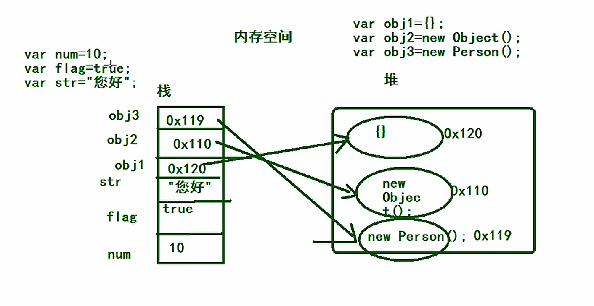
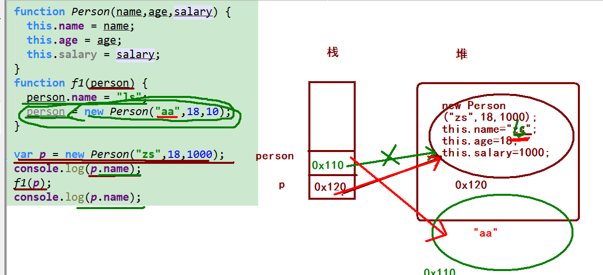
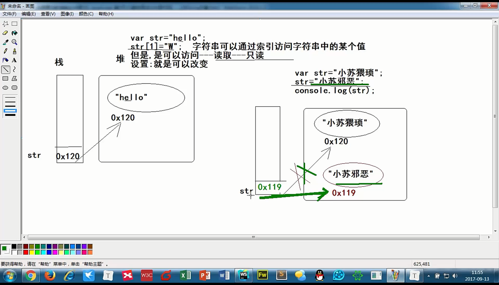

# 基础

## 交换变量方式

```javascript
//利用第三方变量进行交换
    var num1 = 10;
    var num2 = 20;
    var temp;
    temp = num1;
    num1 = num2;
    num2 = temp;
    console.log(num1);
    console.log(num2);
```

```javascript
//一般适用于数字交换
    var  num1 = 10;
    var  num2 = 20;
    num1 = num1 + num2;
    num2 = num1 - num2;
    num1 = num1 - num2;
    console.log(num1, num2);
```

## 类型转换

```javascript
 //类型转换
 parseInt()---------->转整数
 parseFloat()-------->转浮点数
 Number()------------>转数字
 .toString()---------->转字符串(严格)
 String()------------->转字符串(不严格)
 Boolean()------------>布尔值(true或false)
```

## 变量

```javascript
var number=10;
    var num1=20;
    var  name ="小黑";
    var flag = true;
    var nll = null;
    var  obg = Object();
```

## 字符串

```javascript
//字符串可以用单引号，双引号括起来
    var str1='jfdsghiuijhvjfkvui';
    var str2="jfdsghiuijhvjfkdsgfyugfvui";
    //获取字符串长度用变量名.length
    console.log(str1.length);
    console.log(str2.length);
//    字符串拼接用+
    var  pinJie1= "我是";
    var  pinJie2= "小明";
    console.log(pinJie1+pinJie2);
```

## 操作符

```javascript
操作符:一些符号-----用来计算
算数运算符:  +  -  * / %
算数运算表达式:由算数运算符连接起来的表达式
一元运算符: 这个操作符只需要一个操作数就可以运算的符号  ++  --
二元运算符: 这个操作符需要两个操作数就可以运算,
三元运算符: -----不讲,明天讲
复合运算符: +=  -=  *= /= %=
复合运算表达式:由复合运算符连接起来的表达式
     *
     * var num=10;
     * num+=10;------>就是:num=num+10;
     * console.log(num);20
     *
关系运算符: >  <  >=  <=  ==不严格的 ===严格的 !=不严格的不等 !==严格的不等
     * 关系运算表达式:由关系运算符连接起来的表达式
     * 关系运算表达式的结果是布尔类型
     * 逻辑运算符:
     * &&---逻辑与--并且
     * ||---逻辑或---或者
     * !---逻辑非---取反--取非
     * 逻辑运算表达式:由逻辑运算符连接起来的表达式
     * 表达式1&&表达式2
     * 如果有一个为false,整个的结果就是false
     * 表达式1||表达式2
     * 如果有一个为true,整个的结果为true
     * !表达式1
     * 表达式1的结果是true,整个结果为false
     * 表达式1的结果是false,整个结果为true
     *
     * 赋值运算符:  =
     * */
    
    //字面量: 把一个值直接赋值给一个变量

    //声明变量并初始化
//    var num=10;
//
//    var flag=true;
//
//    var str="哈哈哈";
//
//    var y=10;
//    var n=y;
```

## 类型转换	

```javascript
//转整数parseInt
    console.log(parseInt("10"));
    console.log(parseInt("10dsj"));
    console.log(parseInt("dfe10"));
    console.log(parseInt("1fvdsfg0"));
    console.log(parseInt("fd1fvdsfg0sd"));
    /*
    输出结果
      10
      10
      NaN
      1
      NaN
    */


    //转小数parseFloat
    console.log(parseFloat("10.98"));
    console.log(parseFloat("10.98dsj"));
    console.log(parseFloat("dfe10.98"));
    console.log(parseFloat("1fvdsfg0"));
    console.log(parseFloat("fd1fvdsfg0.98sd"));
    /*
    输出结果
    10.98
    10.98
    NaN
    1
    NaN
    */


    //转数字
    console.log(Number("10.98"));
    console.log(Number("10.98dsj"));
    console.log(Number("dfe10.98"));
    console.log(Number("1fvdsfg0"));
    console.log(Number("fd1fvdsfg0.98sd"));
    /*
    输出结果
    10.98
     NaN
     NaN
     NaN
     NaN
    */


    //转字符串
    // 两种方式:1. toString    2. String
    var num1=10;
    console.log(num1.toString());
    //有意义
    var  num2;
    var  num3=null;
    console.log(String(num2));
    console.log(String(num3));
    //无意义，以及为空用


//    转Boolean布尔类型  重要！！！
    console.log(Boolean(10));       //true
    console.log(Boolean(0));        //false
    console.log(Boolean(10.43));    //true
    console.log(Boolean(-10));      //true
    console.log(Boolean(""));       //false
    console.log(Boolean(null));     //false
    /*
        只要结果不为0，空，未定义就位true
    */
```

## 进制

```javascript
// 十进制12
    var num1 = 12;
    //    八进制8
    var num2 = 010;
    //    十六进制20
    var  num3 = 0x14;
    console.log(num1);
    console.log(num2);
    console.log(num3);
    //最大最小值的范围
    console.log(Number.MAX_VALUE);
    console.log(Number.MIN_VALUE);
//    不要用小数验证小树
    var x=0.1;
    var y=0.2;
    var sum=x+y;
    console.log(sum);
//    猜测，应该是存在小数精度问题
```

# 顺序、分支(选择)、循环(重复)

## if语句

```javascript
//    if-else
//    用到转换以及获取用户输入
    var age=parseInt(prompt("请输入年龄"));
    if (age>=18){
        console.log("可以看电影");
    } else {
        console.log("年龄太小，不让看");
    }
//else-else if
var results = Number(prompt("请您输入成绩"));
    if (results > 90 && results <= 100) {
        console("A");
    } else if (results <= 90 && results > 80) {
        console.log("B");
    } else{
        
    }
```

## switch语句

```javascript
var level="A";
switch (level) {
    case "A":console.log("90~100之见");break;
    case "B":console.log("80~90之见");break;
    case "C":console.log("70~80之见");break;
    case "D":console.log("60~70之见");break;
    default:
        console.log("60以下");break;
}
```

## if与switch区别

```javascript
/*
*if-else if-else if...
*一般是用于范围判断
*switch case
* 一般用于具体值的判断
*
* */
```

## while循环

```javascript
var sum = 0;
    var i = 0;
    while(i<=100){
        sum=sum+i;
        i++;
    }
    console.log(parseFloat(sum));
```

## do while循环

```javascript
//    do  while循环
/*
* 结构
* do{
*       循环体
* }while(条件);
*至少执行一次
```

## for循环

```javascript
* for循环
*
* 语法:
* for(表达式1;表达式2;表达式3){
*   循环体;
* }
*
* 执行过程:
* 先执行一次表达式1,然后判断表达式2;如果不成立则直接跳出循环
* 如果表达式2成立,执行循环体的代码,结束后,跳到表达式3执行,然后跳到表达式2,判断表达式2是否成立,不成立,则跳出循环
* 如果表达式2成立,则执行循环体,然后再跳到表达式3,再跳到表达式2,判断是否成立,一直如此
*
* for(var i=0;i<10;i++){
*
* }
 */
```

## 一元运算符

```javascript
++在后，先算运算，之后再减一
++在前，先自增，之后再运算
```

## 三元表达式

```javascript
//求最大值
var n1=20;
var n2=40;
var maximum=n1>n2?n1:n2;
console.log(maximum);
```

## break

```javascript
// 找到100~200第一个能被7整除的数字
for (var i=100;i<=200;i++){
    if (i%7==0){
        console.log(i);
        break;
    }
    
}
总结：break会跳出当前循环
```

## continue

```javascript
//目的:continue 在循环中遇到continue,直接开始下一次循环
// 求100~200之见所有除了个位数为3的和
    var sum = 0;
    var i = 100;
    while (i <= 200) {
        if (i % 10 == 3) {
            i++;
            continue;
        }
        sum += i;
        i++;
    }
    console.log(sum);
```

# 数组

```javascript
//数组:一组有序的数据
    //数组的作用:可以一次性存储多个数据
    //数组的定义:
    /*
    * 1. 通过构造函数创建数组
    * 语法:

    * var 数组名=new Array();
    * var array=new Array();//定义了一个数组
    * 数组的名字如果直接输出,那么直接就可以把数组中的数据显示出来,如果没有数据,就看不到数据
    *
    * var 数组名=new Array(长度);
    * 如果数组中没有数据,但是有长度---,数组中的每个值就是undefined
    */
    // var array=Array();
    // console.log(array);
    /*
    * 2.  通过自变量的方式
    * 语法:var 数组名=[]; 空数组
    *
    * var arr=[5];
    * console.log(arr);
    */
//数组索引从0开始
    /*var arr=[10,20.30,40];
    console.log(arr[2]);
    // 结果40
    // 修改某个数组位置的值
    arr[1]=1000;
    console.log(arr[1]);
    // 结果1000*/
//    输出数组长度
//     var sz=[10,20,30];
//     console.log(sz.length);
```

```javascript
//    遍历数组
    var arr=[10,20,30,40,50];
    for (i=0;i<arr.length;i++){
        console.log(arr[i]);
    }
```

```javascript
 // 冒泡排序法
    // 原理：每个数和后面的数依次比较，如果大于或者小于则交换位置，最终实现排序
    var arr = [10, 2, 3, 54, 43, 22, 67, 90];
    for (i = 0; i < arr.length - 1; i++) {
        for (j = 0; j < arr.length - 1 - i; j++) {
            if (arr[j] > arr[j + 1]) {
                var temp = arr[j];
                arr[j] = arr[j + 1];
                arr[j + 1] = temp;
            }
        }
    }
    console.log(arr);
```

# 函数

## 函数1

```javascript
    //函数:把一坨重复的代码封装,在需要的时候直接调用即可
    //函数的作用:代码的重用
    /*
    *
    * 函数的定义
    * 语法:
    *
    * function 函数名字(){
    *   函数体-----一坨重复的代码
    * }
    *
    * 函数的调用:
    *
    * 函数名();
    *
    *
    *
    * */
```

```javascript
	//函数需要先定义,然后才能使用
    //函数名字:要遵循驼峰命名法
    //函数一旦重名,后面的会把前面的函数覆盖
    //Ctrl +鼠标左键---->转到定义
    //一个函数最好就是一个功能
```

## 函数2

```javascript
 //函数定义，还没有执行
    function consoleSum(x, y) {
        var sum = x + y;
        console.log(sum);
    }

    // 传递值，函数执行
    sum1 = 10;
    sum2 = 20;
    consoleSum(sum1, sum2);
```

```javascript
  /*
 * 函数参数:
 * 在函数定义的时候,函数名字后面的小括号里的变量就是参数,目的是函数在调用的时候,用户传进来的值操作
 * 此时函数定义的时候后面的小括号里的变量叫参数;写了两个变量,就有两个参数,
 * 在函数调用的时候,按照提示的方式,给变量赋值--->就叫传值,把这个值就传到了变量(参数)中
 *
 * 形参:函数在定义的时候小括号里的变量叫形参
 * 实参:函数在调用的时候小括号里传入的值叫实参,实参可以是变量也可以是值
 *
 *
 * */
```

```javascript
*/
    //set:设置
    //get:获取
    //函数的返回值:在函数内部有return关键字,并且在关键字后面有内容,这个内容被返回了
    //当函数调用之后,需要这个返回值,那么就定义变量接收,即可
    /*function getSum(x,y) {
        return x + y;
    }
    // getSum(10,20);
    var ad=getSum(10,20);
    console.log(ad);*/


    /*
    *
    * 如果一个函数中有return ,那么这个函数就有返回值
    * 如果一个函数中没有return,那么这个函数就没有返回值
    * 如果一个函数中没有明确的返回值,那么调用的时候接收了,结果就是undefined
    * (没有明确返回值:函数中没有return,函数中有return,但是return后面没有任何内容)
    * 函数没有返回值,但是在调用的时候接收了,那么结果就是undefined
    * 变量声明了,没有赋值,结果也是undefined
    * 如果一个函数有参数,有参数的函数
    * 如果一个函数没有参数,没有参数的函数
    * 形参的个数和实参的个数可以不一致
    * return 下面的代码是不会执行的
    *
    *
    *
    * */
```

## 复习

```javascript
 /*
     *
     * break:在循环中遇到这个关键字,直接跳出当前所在的循环
     * continue:在循环中遇到这个关键字,直接进行下一次循环
     * 数组:存储一组有序的数据,数据类型可以不一样
     * 数组的作用:一次性存储多个数据
     * 数组元素:数组中存储的每个数据,叫数组元素,存储了5个数据,有5个数组元素
     * 数组的长度:数组的元素的个数,叫数组的长度:数组名.length--->就是长度,数组的长度是可以改变的
     * 索引(下标):存储数组元素的编号,从0开始,到数组的长度-1结束
     * 索引是用来存储和读取数组元素的
     * 遍历数组:通过循环的方式找到数组中的每个数据
     * 冒泡排序:
     * 求数组的和,最大值,最小值,平均值
     *
     * 数组定义的方式:
     * 1. 通过构造函数定义数组
     * var 数组名=new Array();空数组 Array()就是构造函数
     * var 数组名=new Array(长度);是设置数组的初始的长度,长度是可以改变的
     * var 数组名=new Array(值,值,值...);定义数组并设置数组中的元素值
     * 2. 字面量的方式定义数组
     * var 数组名=[];空数组
     * var 数组名=[10];这个数组有一个元素,值是10,长度是1
     * 数组变量
     * for(var i=0;i<数组名.length;i++){
     *
     * }
     *
     *
     * 函数:把一些重复的代码封装起来,在需要的时候直接调用这个函数就可以了
     * 函数作用:代码的重用
     * 函数定义:
     * function 函数名(){
     *     函数体
     * }
     * 函数调用:
     * 函数名();
     *
     * 参数:形参和实参
     * 形参:函数定义的时候函数名字后面的小括号里的变量就是参数,是不需要写var
     * 实参:函数调用的时候小括号里传入的变量或者是值,都是实参
     * 返回值:函数中如果有return,那么这个函数就有返回值
     * 如果函数中没有return,那么这个函数没有返回值
     * 如果函数中有return,但是后面什么内容都没有,这个函数没有明确返回值
     * 如果一个函数没有明确的返回值,函数调用了,并且接收了,那么此时接收的结果undefined
     * 如果直接输出函数名字,那么是这个函数的代码
     * 无参数无返回值的函数
     * function f1(){
     *
     * }
     * 有参数无返回值的函数,2个参数
     * function f2(x,y){
     *
     * }
     * 无参数有返回值的函数
     * function f3(){
     *   return 100;
     * }
     * 有参数有返回值的函数
     * function f4(x){
     *  return "您好";
     * }
     *
     *
     *
     *
     * */
	//隐式全局变量
    //    for( i=0;i<10;i++){
    //      console.log("今天天气真好");
    //    }
```

## 函数的其他定义形式

```javascript
/*
        *   时间：2019年4月17日 19:04:52
        *   目的：命名函数 匿名函数
        *   结果：
        *       --------------------
        *
        *
        *
        *       --------------------
        *
        **/
    /*
     * 命名函数:函数如果有名字,就是命名函数
     *
     * 匿名函数:函数如果没有名字,就是匿名函数
     *
     * 函数的另一种定义方式
     * 函数表达式:
     * 把一个函数给一个变量,此时形成了函数表达式
     * var 变量=匿名函数;
     * 例子:
     * var f1=function (){
     *
     * };
     * 如果是函数表达式,那么此时前面的变量中存储的就是一个函数,而这个变量就相当于是一个函数,就可以直接加小括号调用了
     * f1();
     *
     * 注意:
     * 函数表达式后面,赋值结束后,要加分号
     *
     *
     *
     * 函数定义:
     * 1. 函数声明--函数定义
     * function 函数名(){
     *     函数体
     * }
     *
     * */
    // 匿名函数
    //     只是没有名字，并且把函数赋给了f1
    /*var f1=function () {
        console.log("哈哈");
    };
    f1();*/
    // 匿名函数可以重复调用定义，不用担心函数重命名
    /*var f1 = function () {
        console.log("我是第一个");
    };
    f1();
    f1 = function () {
        console.log("我是第二个");
    };
    f1();*/
    // 函数的自调用，自调用函数
    //就是一次性，用完就没有，不担心命名冲突
    (function () {
        console.log("我是自调用函数");
    })();
```

## 函数作为参数使用

```javascript
   
    // 函数可以作为参数使用，如果一个函数作为参数使用，那么我们可以说这个参数（函数）叫做回调函数
    // 只要看到一个函数作为参数使用了，那就是回调函数
    function f1(fn) {
        fn();
    }
    function f2() {
        console.log("这是回调参数");
    }
    f1(f2);
```

## 函数作为返回值使用

```javascript
function f1() {
        return function () {
            console.log("返回值");
        }
    }

    var ff = f1();
    ff();
```

## 函数也是一种数据类型

```javascript
    function f() {

    }

    console.log(typeof f);
//    结果，函数类型function
```

## 冒泡排序

```javascript
//从大到小
    var arr = [10, 20, 3, 4, 5, 45];
    // 冒泡排序，肯定有进行比较，之后交换数据
    //进行轮数循环
    for (var i = 0; i < arr.length - 1; i++) {
        //进行每轮比较
        for (var j = 0; j < arr.length - i - 1; j++) {
            if (arr[j] > arr[j + 1]) {
                //    利用第三方变量交换数据
                var temp;
                temp = arr[j];
                arr[j] = arr[j + 1];
                arr[j + 1] = temp;
            }
        }
    }
    console.log(arr);
```

## 域解析

```javascript
  /*
    *   结果：预解析可以吧一些定义代码提到前面
    *       --------------------
    *   预解析:就是在解析代码之前
    *   预解析做什么事?
    *   把变量的声明提前了----提前到当前所在的作用域的最上面
    *   函数的声明也会被提前---提前到当前所在的作用域的最上面
    *   先提升var,在提升function
    *   预解析会分段(多对script标签中函数重名，预解析不会冲突)
    *       --------------------
    *
    **/
```

## 作用域

```javascript
//作用域:使用范围
        /*
        *
        * 全局变量:声明的变量是使用var声明的,那么这个变量就是全局变量,全局变量可以在页面的任何位置使用
        * 除了函数以外,其他的任何位置定义的变量都是全局变量
        * 局部变量:在函数内部定义的变量,是局部变量,外面不能使用
        * 全局变量,如果页面不关闭,那么就不会释放,就会占空间,消耗内存
        *
        * 全局作用域:全局变量的使用范围
        * 局部作用域:局部变量的使用范围
        *
        * 块级作用域:一对大括号就可以看成是一块,在这块区域中定义的变量,只能在这个区域中使用,但是在js中在这个块级作用域中定义的变量,外面也能使用;
        * 说明:js没有块级作用域,只有函数除外
        *
        * 隐式全局变量:声明的变量没有var,就叫隐式全局变量
        * 全局变量是不能被删除的,隐式全局变量是可以被删除的
        * 定义变量使用var是不会被删除的,没有var是可以删除的
        *
        *
        * */
        // 在函数作用域内加var定义的变量是局部变量，不加var定义的就成了全局变量。

        //    function f1() {
        //      number=1000;//是隐式全局变量
        //    }
        //    f1();
        //    console.log(number);

```

## 作用域链

```javascript
/*
    *   时间：2019年4月6日 12:26:11
    *   目的：作用域链
    *   结果：函数套函数，如果函数里面找不到变量，就去上一级找，直到找不到报错
    *       --------------------
    *
    *
    *
    *       --------------------
    *
    **/
    var num=10;
    function f1() {
        var num=20;
        function f2() {
            var num=30;
            function f3() {
                var num=50;
                console.log(num);
            }
            f3();
        }
        f2();
    }
    f1();
```

## arguments伪数组

```javascript
 /*
    *   时间：2019年4月17日 19:04:52
    *   目的：arguments        //意思:参数
    *   结果：获取函数在调用的时候，传入了几个参数
    *       --------------------
    *       使用arguments可以获得每个传入对象的值
    *
    *
    *       --------------------
    *
    **/
    /*function f1() {
        console.log(arguments.length);
        console.log(arguments);
    }
    f1(10,20,30,40);*/
    // 计算n个数字的和
    function nSum() {
        var sum=0;
        //把arguments当成数组使用      //注意：是伪数组
        for (var i=0;i<arguments.length;i++){
            sum+=arguments[i];
        }
        return sum;
    }
    console.log(nSum(10,20,30,40));
```


## 复习

```javascript
/*
    * 复习:
    * 函数:把一些重复的代码封装在一个地方,在需要的时候直接调用这个地方的代码就可以了
    *
    * 函数作用:代码重用
    *
    * 函数的参数:
    * 1.形参:函数定义的时候,函数名字后面的小括号里的变量
    * 2.实参:函数调用的时候,函数名字后面的小括号里的变量或者值
    *
    * 返回值:
    * 函数中有return，函数有返回值
    * 函数中没有return,函数没有返回值
    * 没有明确返回值:函数中没有return或者return后面没有任何内容
    * 如果一个函数没有明确的返回值,接收这个函数,结果是undefined
    *
    * 无参数无返回值的函数
    * 无参数有返回值的函数
    * 有参数无返回值的函数
    * 有参数有返回值的函数
    *
    * arguments----->可以获取函数调用的时候,传入的实参的个数
    * arguments是一个对象,是一个伪数组
    * arguments.length--->是实参的个数
    * arguments[索引]---->实参的值
    *
    * 作用域:变量的使用范围
    * 全局作用域:全局变量在任何位置都可以使用的范围
    * 局部作用域:局部变量只能在某个地方使用---函数内
    * 作用域链:在一个函数中使用一个变量,先在该函数中搜索这个变量,找到了则使用,找不到则继续向外面找这个变量,找到则使用,一直找到全局作用域,找不到则是undefined
    * 全局变量:只要是在函数外面声明的变量都可以看成或者是理解成是全局变量
    * 局部变量:在函数中定义的变量
    *
    * 预解析:在执行代码之前做的事情
    * 变量的声明和函数的声明被提前了,变量和函数的声明会提升到当前所在的作用域的最上面
    * 函数中的变量声明,会提升到该函数的作用域的最上面(里面)
    * 如果有多对的script标签都有相同名字的函数,预解析的时候是分段的,互不影响
    *
    *
    *
    *
    *
    *
    * */
```

# 对象

## 简单类型和复杂类型

```javascript
//原始数据类型: number,string,boolean,undefined, null,object
    //基本类型(简单类型),值类型: number,string,boolean
    //复杂类型(引用类型):object
    //空类型:undefined,null

    //值类型的值在哪一块空间中存储? 栈中存储
    //引用类型的值在哪一块空间中存储?对象在堆上存储,地址在栈上存储

    //var num=10;//值类型,值在栈上
    //var obj={};//复杂类型,对象在堆,地址(引用)在栈

    //值类型之间传递,传递的是值
    //引用类型之间传递,传递的是地址(引用)

    //值类型作为函数的参数,传递的是值
    //引用类型作为函数的参数,传递的是地址

```



## 编程思想的概述

```javascript

    //编程思想:     把一些生活中做事的经验融入到程序中
    //面向过程:     凡事都要亲历亲为,每件事的具体过程都要知道,注重的是过程
    //面向对象：     根据需求找对象,所有的事都用对象来做，注重的是结果
    /*
    *
    *
    * 面向对象特性:封装,继承,多态 (抽象性)
    * js不是面向对象的语言,但是可以模拟面向对象的思想
    * js是一门基于对象的语言:
    * 万物皆对象:---------->程序猿 程旭媛
    *
    * * 什么是对象?
    * 看的见,摸得到,具体特指的某个东西
    *
    * 找对象
    * 描述找对象
    * 文字描述找对象
    * 小明牵着小黄去逛街
    * 一台电视机正在播放影片
    *
    *
    *
    *
    * 分析对象有什么特点:特征和行为
    *
    * 对象:有特征和行为,具体特指的某一个事物
    *
    *
    *
    * 对象:有属性和方法,具体特指的某个事物
    *
    *
    *
    *
    * 没有对象
    *
    *
    * 创建对象
    *
    *
    *https://www.codecombat.cn/play/dungeon
    *
    *
    *
    * */
```

## 创建对象的图解

```javascript

        //1 调用构造函数创建对象
        var obj=new Object();

        //2. 自定义构造函数创建对象

        //自定义构造函数
        function Person(name,age) {
            this.name=name;
            this.age=age;
            this.sayHi=function () {
                console.log("您好,我叫:"+this.name);
            };
        }
        //创建对象----实例化一个对象,并初始化
        var per=new Person("小明",20);
        per.name="张三";
        //四件事:
        /*
        * 1. 开辟空间,存储创建的新的对象
        * 2. 把this设置为当前的对象
        * 3. 设置对象的属性和方法的值
        * 4. 返回创建后新的对象
        *
        *
        * */
    //    内存分为栈和堆
```

## 调用系统的构造函数创建对象

```javascript
 //创建对象三种方式:
    /*
     *
     * 1.调用系统的构造函数创建对象
     * var 变量名= new Object(); Object 是系统的构造函数  Array
     *
     * 2.自定义构造函数创建对象(结合第一种和需求通过工厂模式创建对象)
     *
     *
     * 3.字面量的方式创建对象
     *
     *
     * */
                    //构造函数就是首字母大写，后面小写，如Array,Object

    //第一种创建对象的方式
    //小苏举例子:
    //实例化对象
    var obj = new Object();
    //对象有特征---属性和行为---方法
    //添加属性-----如何添加属性?  对象.名字=值;
    obj.name = "小苏";
    obj.age = 38;
    obj.sex = "女";
    //添加方法----如何添加方法? 对象.名字=函数;
    obj.eat = function () {
        console.log("我喜欢吃油炸榴莲凉拌臭豆腐和大蒜");
    };
    obj.play = function () {
        console.log("我喜欢玩飞机模型");
    };
    obj.cook = function () {
        console.log("切菜");
        console.log("洗菜");
        console.log("把菜放进去");
        console.log("大火5分钟");
        console.log("出锅");
        console.log("凉水过一下");
        console.log("放料,吃");
    };
    console.log(obj.name);//获取--输出了
    console.log(obj.age);
    console.log(obj.sex);
    //方法的调用
    obj.eat();
    obj.play();
    obj.cook();

```

## 调用自定义构造函数创建对象

```javascript
    //自定义构造函数创建对象,我要自己定义一个构造函数,自定义构造函数,创建对象
    //函数和构造函数的区别；名字是不是大写(首字母是大写)
    function Dog(name, age) {
        this.name = name;
        this.age = age;
        this.hello = function () {
            console.log("你好我叫" + this.name + "今年" + this.age);
        }
    }

    var dog = new Dog("小明", 18);
    var cat = new Dog("小军", 19);
    dog.hello();


    cat.hello();
    console.log(Dog() instanceof dog);
```

## 工厂模式创建对象

```
   /*
     *
     * 如何获取该变量(对象)是不是属于什么类型的?
     * 语法:
     * 变量 instanceof 类型的名字----->布尔类型,true就是这种类型,false不是这种类型
     * 在当前的对象的方法中,可以使用this关键字代表当前的对象
     *
     *
     * */

    //对象不能分辨出到底是属于什么类型?

    //如何一次性创建多个对象?把创建对象的代码封装在一个函数中

    //工厂模式创建对象
    factoryCreation=function  (name,age) {
        var obg=new Object();
        obg.name=name;
        obg.age=age;
        obg.greet=function () {
            console.log("你好，我叫"+this.name+"今年"+this.age+"岁了");
        };
        obg.greet();
    };
    factoryCreation("小军",15);
    factoryCreation("小明",16);
//工厂模式就是提前定义封装好，到时候直接传内容用就行
```

## 内置对象

```javascript
 /*
    时间：2019年5月24日 20:20:00
    目的关于对象


    ---------------------
    在Webstorm中输出的结果是：
    ---------------------
    */
//    js学习中的三种对象
    /*
    * 1.内置对象---------js系统自带的对象
    * 2.自定义对象-------自己定义的构造函数创建的对象
    * 3.浏览器对象-------BOM的时候讲
    * */


//    如何验证变量是不是对象？
    console.log(Array instanceof Object);
    var obj={};
    console.log(obj instanceof Object);
//    内置对象
    /*
    * Math
    * Date
    * String
    * Array
    * */
```

## 设置和获取属性的另一种方法

```javascript
 通过中括号以及双引号的方式调用
 //自定义构造函数
    function People(name, age) {
        this.name = name;
        this.age = age;
        this.eat = function () {
            console.log("拿筷子");
            console.log("吃");
        };
    }

    var people_1 = new People("小明", 18);
    //点语法
    console.log(people_1.name);
    console.log(people_1.age);
    people_1.eat();
    //中括号
    console.log(people_1["name"]);
    console.log(people_1["age"]);
    people_1["eat"]();
```

## 自变量的方式创建对象

```javascript
//    原来方式
    /*
//    调用构造函数
    var obj = new Object();
    obj.name = "小米";

    //自定义构造函数
    function Obg(name, age) {
        this.name = name;
        this.obg = obg;
    }

    var obg = new Obg("小米", 18);

     */
    // 自变量
    /*var obg = {};
    obg.name = "小明";
    obg.age = 18;
    obg.ganHuo = function () {
        console.log(this.name + "会干活");
    };
    console.log(obg.name);
    console.log(obg.age);
    obg.ganHuo();*/

    /*var obg = {
        name: "小明",
        age: 18,
        ganHuo: function () {
            console.log(this.name + "会干活");
        }
    };
    console.log(obg.name);
    console.log(obg.age);
    obg.ganHuo();*/
//    现在可以暂时理解为只要有花括号的就是对象
```

## 自定义构造函数创建对象做了四件事

```javascript

	   目的：理解自定义对象，系统做了什么事情

    //自定义构造函数创建对象,我要自己定义一个构造函数,自定义构造函数,创建对象
    //函数和构造函数的区别；名字是不是大写(首字母是大写)
    /*function Dog(name, age) {
        this.name = name;
        this.age = age;
        this.hello = function () {
            console.log("你好我叫" + this.name + "今年" + this.age);
        }
    }

    var dog = new Dog("小明", 18);
    var cat = new Dog("小军", 19);
    dog.hello();*/
    /*
    *
    * 1. 在内存中开辟(申请一块空闲的空间)空间,存储创建的新的对象
    * 2. 把this设置为当前的对象
    * 3. 设置对象的属性和方法的值
    * 4. 把this这个对象返回
    *
    *
    * */

    //通过自定义构造函数实现下面的例子:

    //创建一个图片的对象,图片有宽,有高,有大小(4M),图片可以展示内容
    /*function Tupian(kuan,gao,daxiao) {
        this.kuan=kuan;
        this.gao=gao;
        this.daxiao=daxiao;
        this.xingwei=function () {
            console.log("展示内容");
        };

    }
    var tuPian=new Tupian("500px","200px","4M");
    console.log(tuPian.kuan);
    console.log(tuPian.gao);
    console.log(tuPian.daxiao);
    tuPian.xingwei();*/
```



## 总结对象

```javascript
   //字面量创建对象的缺陷: 一次性的对象

        //    var obj={
        //      name:"小明",
        //      age:38,
        //      sex:"女"
        //    };
        //    obj.name="小三";
        //    console.log(obj.name);

        //点语法:   对象.名字=值; 对象.名字=函数;
        //没有什么点,就有了

        /*
         *
         * js是一门什么样的语言?
         * 是一门解释性的语言
         * 是一门脚本语言
         * 是一门弱类型语言,声明变量都用var
         * 是一门基于对象的语言
         * 是一门动态类型的语言:
         * 1. 代码(变量)只有执行到这个位置的时候,才知道这个变量中到底存储的是什么,如果是对象,就有对象的属性和方法,如果是变量就是变量的作用
         * 2. 对象没有什么,只要点了,通过点语法,那么就可以为对象添加属性或者方法
         *
         *
         *
         * */
```

## json格式的数据

```
 //对象:有属性和方法,特指的某个事物
        //对象:一组无序属性的集合的键值对,属性的值可以是任意的类型
        //    function Dog(name) {
        //      this.name=name;
        //    }
        //    function Person(name,age) {
        //      this.age=age;
        //      this.name=name;
        //      this.sex=true;
        //      this.dog={};
        //      this.play=function () {
        //        console.log("喜欢玩游戏");
        //      };
        //    }
        //
        //    var sex=false;//男
        //    console.log(sex?"男":"女");


        //JSON格式的数据:一般都是成对的,是键值对,

        //json也是一个对象,数据都是成对的,一般json格式的数据无论是键还是值都是用双引号括起来的

        //    var obj={
        //      name:"小明"
        //    };


        /*var json = {
            "name": "小明",
            "age": "10",
            "sex": "男"
        };*/
        //遍历对象,是不能通过for循环遍历,无序

        //key是一个变量,这个变量中存储的是该对象的所有的属性的名字
      /*  for (var key in json) {
            console.log(key + "===========" + json[key]);
        }*/


        //    var key="name";
        //    console.log(json[key]);
        //可以通过for-in循环
        //
        //    for(var key in json){
        //      //console.log(key);//json对象中的属性的名字
        //      console.log(json[key]);
        //    }
        //对象中确实有这个属性对象.属性名字  或者对象[属性名字]


        //一个一个的遍历出来

        //    var arr=[10,20,30];
        //    for(var i=0;i<arr.length;i++){
        //      console.log(arr[i]);
        //    }
        //json数据练习
        var json= {
            "name": "小军",
            "sex": "男",
            "age": "16",
            "eat": function () {
                console.log("会吃饭");
            }
        };
        for(var i in json){
            console.log(i+"---------"+json[i]);
        }
```

## Math对象

```javascript
    */
    //    Math 是一个内置对象， 它具有数学常数和函数的属性和方法。不是一个函数对象。
    //MDN----在线的帮助文档


    //实例对象:通过构造函数创建出来,实例化的对象
    //静态对象:不需要创建,直接就是一个对象,方法(静态方法)直接通过这个对象名字调用,
    //实例方法必须通过实例对象调用
    //静态方法必须通过大写的对象调用

    /*
    * Math.PI---------------------π
    * Math.E----------------------常数的底数
    * Math.abs(值)----------------绝对值
    * Math.ceil(值)---------------向上取整
    * Math.floor(值)--------------向下取整
    * Math.max(值,值,值)-----------找一组数字中的最大值
    * Math.min(值,值,值)-----------找一组数字中的最小值
    * Math.pow(x,y)---------------计算x的y次幂
    * Math.sqrt(值)---------------计算数字的平方根
    * Math.random()---------------产生随机数*/


    //    实验
    console.log(Math.PI);                       //打印π
    console.log(Math.abs(-10));                 //打印绝对值
    console.log(Math.ceil(12.02));              //向上取整
    console.log(Math.floor(12.99));             //向下取整
    console.log(Math.fround(3.1));              //把小数转换成计算机存储的单精度小数     //实验,不推荐使用
    console.log(Math.max(10, 20, 30, 2, 1));        //找一组数字中的最大值
    console.log(Math.min(10, 20, 30, 2, 1));        //找一组数字中的最小值
    console.log(Math.pow(10, 2));                //Math.pow()计算x的y次幂
    console.log(Math.sqrt(16));                 //计算数字的平方根
    console.log(Math.random());                 //产生随机数
    // 范围0~1之见，如果需要产生整数的话需要这样
    console.log(parseInt(Math.random()*5)+1);   //0~5之见
    console.log(parseInt(Math.random()*10)+1);  //0~10之见
```

## 复习

```javascript
/*
        * 复习
        * 编程思想:
        * 面向过程:凡事亲力亲为,所有的事情的过程都要清楚,注重的是过程
        * 面向对象:提出需求,找到对象,对象解决这个问题,我们要结果,注重的是结果
        *
        * 面向对象的特性:封装,继承,多态,(抽象性)
        *
        * JS是一门什么样的语言?
        * 是一门解释性的语言
        * 是一门脚本语言
        * 是一门弱类型的语言
        * 是一门基于对象的语言
        * 是一门动态类型的语言
        *
        * 对象:有属性和方法,具体特指的某个事物
        * 对象:js中就是一组无序的属性的集合
        * 属性----特征
        * 方法----行为
        * 创建的对象的方式:
        * 1.通过调用系统的构造函数创建对象 new Object()
        * var obj1=new Object();
        * 2.自定义构造函数创建对象
        * var obj2=new 自定义构造函数();
        * 3.字面量的方式创建对象
        * var obj3={};
        * 变量 instanceof 对象------->布尔类型,判断这个变量是不是这个类型的
        *
        * JSON格式的数据,都是键值对,成对的数据
        * var obj={
        *   name:"小明"
        * };
        * var json={
        *   "name":"小明"
        * };
        *
        * json的数据实际上就是格式化后的一组字符串的数据
        *
        * 对象设置属性的值的写法
        * 对象.属性名字=值;----点语法
        * 对象["属性的名字"]=值;-----
        *
        * 对象获取属性的值的写法
        * 对象.属性
        * 对象["属性"]
        *
        * 遍历对象
        * for(var key in 对象){   key---是一个变量,这个变量中存储的是遍历的对象的属性的名字
        *
        * }
        *
        *
        * 原始数据类型:number,string,boolean,null,undefined,object
        * 基本类型(简单类型,值类型):number,string,boolean
        * 复杂类型(引用类型):object
        * 空类型:undefined,null
        *
        * 基本类型的值在栈上
        * 复杂类型的对象在堆上,地址(引用)在栈上
        *
        * 值类型之间传递的是值
        * 引用类型之间传递的是引用(地址)
        *
        *
        * 对象分三种:内置对象,自定义对象,浏览器对象
        * 内置对象:系统提供的
        * 自定义对象：自己写的
        * 浏览器对象:浏览器的
        *
        * Math 是一个对象,但是不是一个函数
        * Math对象下的属性和方法都是静态
        *
        * 方法:
        * Math.ceil()---向上取整
        * Math.floor()---向下取整
        * Math.Pi----圆周率的值
        * Math.Max()---一组数字中的最大值
        * Math.Min()---一组数字中的最小值
        * Math.abs()----绝对值
        * Math.random---随机数字
        * Math.sqrt()----开平方
        * Math.pow()----一个数字的多少次幂
        *
        *
        *
        *
        *  new 的执行过程:----->new的时候，系统做了什么事?
        *  1. 开辟空间,存储创建的新的对象
        *  2. 把this设置为当前的对象
        *  3. 设置属性和方法的值
        *  4. 返回当前的新的对象
        *
        *
        *
        *
        *
        *
        *
        *
        *
        *
        *
        *
        *
        *
        *
        *
        *
        * */
    //
    //    var obj={
    //      name:"牙擦苏",
    //      age:20,
    //      sex:"男",
    //      height:198,
    //      weight:55
    //    };
    //    var objs={
    //      "name":"值"
    //    };
    //    //遍历对象
    //    for(var key in obj){
    //      console.log(key+"======>"+obj[key]);
    //    }


    var obj = {
        "name": "牙擦苏",
        "age": 20,
        "sex": "男",
        "height": 198,
        "weight": 55
    };
    var objs = {
        "name": "值"
    };
    //遍历对象
    for (var key in obj) {
        console.log(key + "======>" + obj[key]);
    }
```

## 格式化日期时间

```
        目的：自己封装函数按照中国人的方式显示日期时间

    console.log(getDate(new Date()));
```

js部分

```javascript
/**
 * 获取指定的时间
 * @param dt 日期的对象
 * @returns {string} 返回的是字符串的时间
 */
function getDate(dt) {
    //获取年
    var year = dt.getFullYear();
    //获取月
    var month = dt.getMonth() + 1;
    //获取日
    var day = dt.getDate();
    //获取小时
    var hour = dt.getHours();
    //获取分钟
    var minutes = dt.getMinutes();
    //获取秒
    var seconds = dt.getSeconds();
    month = month < 10 ? "0" + month : month;
    day = day < 10 ? "0" + day : day;
    hour = hour < 10 ? "0" + hour : hour;
    minutes = minutes < 10 ? "0" + minutes : minutes;
    seconds = seconds < 10 ? "0" + seconds : seconds;
    return year + "年" + month + "月" + day + "日 " + hour + ":" + minutes + ":" + seconds;
}
```

## 基本包装类型

```javascript
//基本包装类型

    //普通变量不能直接调用属性或者方法
    //对象可以直接调用属性和方法

    //基本包装类型:本身是基本类型,但是在执行代码的过程中,如果这种类型的变量调用了属性或者是方法,那么这种类型就不再是基本类型了,而是基本包装类型,这个变量也不是普通的变量了,而是基本包装类型对象
    //string number boolean


//    var str="hello";
//    str=str.replace("ll","HH");
//    console.log(str);


//    var str=new String("hello");
//    str=str.replace("ll","HH");
//    console.log(str);
//    str=null;

//    var num=10;//number---->
//    console.log(num.toString());


    //如果是一个对象&&true,那么结果是true
    //如果是一个true&&对象,那么结果是对象


//    var flag=new Boolean(false);
//    var result=true&&flag;
//    console.log(result);


//    var num=10;
//    var num2=Number("10");//转换,没有new---类型转
//    var num3=new Number("10");//基本包装类型

```

## 实现系统Max的方法

```javascript
//    实现系统的Max方法
    function myMax() {
        // 添加一个方法
        this.max = function () {
            var max = arguments[0];
            for (var i = 0; i < arguments.length; i++) {
                if (max < arguments[i]) {
                    max = arguments[i];
                }
            }
            return max;
        };
    }

    //实例对象
    var max = new myMax();
    var max1 = max.max(10, 20, 30, 40);
    console.log(max1);
```

## 字符串的案例

```javascript
 /*var str="我想要截取的字符串";
    var key="截取";
    //先获取想要截取的字符串索引的位置
    index=str.indexOf(key);
    //从指定的位置开始截取，截取两个即可
    str=str.substr(index,2);
    console.log(str);*/
    //找到字符串中所有e出现的位置
    /*var str="hello oed eye age";
    var index=0;
    var key="e";
    while ((index=str.indexOf(key,index))!==-1){
        console.log(index);
        index+=key.length;
    }*/

    //案例3:找到这个字符串中每个字符串出现了多少次
    var str = "zhaoyazhAozhaoGezifuChuan";
    str = str.toLocaleLowerCase();
    var obj = {};
    for (var i = 0; i < str.length; i++) {
        var key = str[i];
        if (obj[key]) {
            obj[key]++;
        } else {
            obj[key] = 1;
        }
    }
    for (key in obj){
        console.log(key+"出现了"+obj[key]);
    }
    /*//案例3:找到这个字符串中每个字符串出现了多少次
    var str3 = "whatOareYyouYnoYshaHleiHoHmyHgod";
    //第一步:把所有的字母全部变成小写
    str3 = str3.toLocaleLowerCase();
    //第二步:创建一个空对象,目的:把字母作为键,次数作为值
    var obj = {};
    //第三步,遍历字符串,获取每个字母
    for (var i = 0; i < str3.length; i++) {
        //判断obj这个对象中有没有这个字母(字母---键)
        var key = str3[i];//每个字母
        if (obj[key]) {//判断obj中有没有这个键
            //对象中有这个字母了
            obj[key]++;
        } else {
            //对象中没有这个字母,那就把字母加到对象中,并且给这个字母一个出现的次数,默认1次
            obj[key] = 1;
        }
    }

    //遍历对象,显示每个字母的次数
    for(var key in obj){
        console.log(key+"这个字母出现了"+obj[key]+"次");
    }*/


    /*// /把对象["属性名字"]--->放在if的判断中即可----判断对象中有没有这个属性
        var obj={
            "sex":"男"
        };
        if (obj["sex"]){
            console.log("有");
        } else {
            console.log("没有");
        }*/
```



## 总结Date对象

```javascript
 var dt=new Date();
    dt.getFullYear();//年
    dt.getMonth();//月-----从0开始
    dt.getDate();//日
    dt.getDay();//星期----从0开始
    dt.toDateString();//日期
    dt.toLocaleDateString();//日期
    dt.toTimeString();//时间
    dt.toLocaleTimeString();//时间
    dt.valueOf();//毫秒
    /*
    // 不支持HTML5的浏览器，可以用下面这种方式
    var now = + new Date();			// 调用 Date对象的valueOf()
    */
```

## Array对象的方法

```javascript
 /*
        * Array.isArray(对象)---->判断这个对象是不是数组
        *.concat(数组,数组,数组,...) 组合一个新的数组
        *.every(函数)--返回值是布尔类型,函数作为参数使用,函数中有三个参数,第一个参数是元素的值，第二个参数是索引值,第三个参数是原来的数组(没用)    如果这个数组中的每个元素的值都符合条件,最后才返回的是true
        *.filter(函数);返回的是数组中每一个元素都复合条件的元素,组成了一个新的数组
        * .push(值);--->把值追加到数组中,加到最后了---返回值也是追加数据之后的数组长度
        * .pop();--->删除数组中最后一个元素,返回值就是删除的这个值
        * .shift();--->删除数组中第一个元素,返回值就是删除的这个值
        * .unshift();--->向数组的第一个元素前面插入一个新的元素,----返回值是插入后的程度
        * .forEach(函数)方法---遍历数组用---相当于for循环
        * .indexOf(元素值);返回的是索引,没有则是-1
        * .join("字符串");----返回的是一个字符串
        * .map(函数);--->数组中的每个元素都要执行这个函数,把执行后的结果重新的全部的放在一个新的数组中
        * .reverse();----->反转数组
        * .sort();---排序的,可能不稳定,如果不稳定,请写MDN中的那个固定的代码
        * .arr.slice(开始的索引,结束的索引);把截取的数组的值放在一个新的数组中,但是不包含结束的索引对应的元素值
        * .splice(开始的位置,要删除的个数,替换的元素的值);一般是用于删除数组中的元素,或者是替换元素,或者是插入元素
        * */


        // Array.isArray(对象)---->判断这个对象是不是数组
        // var arr=[];
        // console.log(arr instanceof Array);
        // console.log(Array.isArray(arr));


        // .concat(数组,数组,数组,...) 组合一个新的数组
        // var arr1=[10,20,30];
        // var arr2=[40,50,60];
        // var arr3=arr1.concat(arr2);
        // console.log(arr3);


        // .every(函数)--返回值是布尔类型,函数作为参数使用,函数中有三个参数,第一个参数是元素的值，第二个参数是索引值,第三个参数是原来的数组(没用)     如果这个数组中的每个元素的值都符合条件,最后才返回的是true
        // var arr = [10, 20, 30];
        // var result = arr.every(function (ele, index) {
        //     return ele > 10;
        // });
        // console.log(result);


        //.filter(函数);返回的是数组中每一个元素都复合条件的元素,组成了一个新的数组
        // var arr = [10, 20, 30, 40];
        // var result = arr.filter(function (ele) {
        //     return ele > 20;
        // });
        // console.log(result);


        // .push(值);--->把值追加到数组中,加到最后了---返回值也是追加数据之后的数组长度
        // var arr=[10,20,30];
        // arr.push(100);
        // console.log(arr);


        // .pop();--->删除数组中最后一个元素,返回值就是删除的这个值
        // var arr=[10,20,30];
        // arr.pop();
        // console.log(arr);


        // .shift();--->删除数组中第一个元素,返回值就是删除的这个值
        // var arr=[10,20,30];
        // arr.shift();
        // console.log(arr);


        // .unshift();--->向数组的第一个元素前面插入一个新的元素,----返回值是插入后的程度
        // var arr=[10,20,30];
        // arr.unshift(100);
        // console.log(arr);


        // .forEach(函数)方法---遍历数组用---相当于for循环
        // var arr=[10,20,30];
        // arr=arr.forEach(function (ele,index) {
        //     console.log(ele+"------->"+index);
        // });


        // .indexOf(元素值);返回的是索引,没有则是-1
        // var arr=[10,20,30];
        // console.log(arr.indexOf(20));


        // .join("字符串");----返回的是一个字符串
        // var arr=[10,20,30];
        // console.log(arr.join("|"));


        // .map(函数);--->数组中的每个元素都要执行这个函数,把执行后的结果重新的全部的放在一个新的数组中
        // var arr=[10,20,30];
        // var newArr=arr.map(Math.sqrt);
        // console.log(newArr);


        // .reverse();----->反转数组
        // var arr=[10,20,30];
        // var newArr=arr.reverse();
        // console.log(newArr);


        //.sort();---排序的,可能不稳定,如果不稳定,请写MDN中的那个固定的代码
        // var arr = [10, 1, 2, 3, 500, 43];
        // var newArr = arr.sort(function (a, b) {
        //     if (a > b) {
        //         return 1;
        //     } else if (a == b) {
        //         return 0;
        //     } else {
        //         return -1;
        //     }
        // });
        // console.log(newArr);


        // .arr.slice(开始的索引,结束的索引);把截取的数组的值放在一个新的数组中,但是不包含结束的索引对应的元素值
        // var arr=[10,20,30,40,50,60];
        // var newArr=arr.slice(2,3);
        // console.log(newArr);


        // .splice(开始的位置,要删除的个数,替换的元素的值);一般是用于删除数组中的元素,或者是替换元素,或者是插入元素
        // var arr=[10,20,30];
        // arr.splice(1,0,"你好");
        // console.log(arr);
```

## Date对象

```javascript

    //创建实例对象
    // //当前时间----当前服务器
    // var dt=new Date();
    // console.log(dt);
    // //自己输入时间
    // dt=new Date("2017/1/1");
    // console.log(dt);
    // //输出从1970年距今毫秒
    // dt=Date.now();
    // console.log(dt);
    var dt = new Date();
    // 获取年份
    console.log(dt.getFullYear());
    // 获取月份
    console.log(dt.getMonth());     //是从0开始，真实月份需要加1
    // 获取日期
    console.log(dt.getDate());
    // 获取小时
    console.log(dt.getHours());
    // 获取分钟
    console.log(dt.getMinutes());
    // 获取秒
    console.log(dt.getSeconds());
    // 获取星期
    console.log(dt.getDay());//是从0开始,0是星期日
    console.log(dt);
    //转成字符串
    console.log(dt.toString());
    console.log(dt.toDateString());//英文的----日期
    console.log(dt.toLocaleDateString());//数字格式----日期
    console.log(dt.toTimeString());//小时分钟秒
    console.log(dt.toLocaleTimeString());//小时分钟秒
```

## String对象

```javascript
 /*
    *
    * String---->是一个对象
    * 字符串可以看成是字符组成的数组,但是js中没有字符类型
    * 字符是一个一个的,在别的语言中字符用一对单引号括起来
    * 在js中字符串可以使用单引号也可以使用双引号
    * 因为字符串可以看成是数组,所以,可以通过for循环进行遍历
    *
    * 字符串特性:不可变性,字符串的值是不能改变
    *
    * 字符串的值之所以看起来是改变的,那是因为指向改变了,并不是真的值改变了
    *
    *
    * */

//    var str="hello";
//    str[1]="W";  字符串可以通过索引访问字符串中的某个值
//    但是,是可以访问---读取---只读
//    设置:就是可以改变
    //对象的方式来看待

//    var str="小苏好猥琐";
//    str="小苏好邪恶了";//重新赋值
//    console.log(str);

//    var str="hello";
//    str[1]="W";
//    console.log(str);
//    for(var i=0;i<str.length;i++){
//      console.log(str[i]);
//    }

//    var str="1";
//    str="2";
//    str="3";

    var str="123";
    str="456";
    console.log(str);


    //String对象

//    string ---->字符串类型----基本类型
//    String---->字
    //
    //    符串类型----引用类型

    //字符串对象----String对象


//    var str1="90";
//    var str2="哈哈,我又变帅了";
//    var str3="안녕하세요.";
//    var str4="こんにちは";
//    var str5="สวัสดี";
//    var str6="Привет ";


    var str="萨瓦迪卡";
    //js中没有字符类型
    //字符类型
    //字符串类型

    /*
    * 整数类型
    * int num=10;
    * 小数
    * float num2=90.4
    * 字符串
    * string str="hello";  //字符串必须用双引号
    * //字符
    * char ch='h';    //字符必须用单引号---值---只有一个
    *
    * char ch='y'
    *
    * 'h'+'e'+'l'+'l'+'o'---- "hello"
    *
    * //字符串是可以看成是多个字符组合成的数组的
    *
    * js中无论是单引号的还是双引号的都是字符串
    *
    *
    * */

//    var str="hello";//可以看成是一个字符数组
//    for(var i=0;i<str.length;i++){
//      console.log(str[i]);
//    }
```

## String对象的方法

```javascript
 /*
     *
     * 实例方法---->必须要通过new的方式创建的对象(实例对象)来调用的方法
     * 静态方法---->直接通过大写的构造函数的名字调用的方法(直接通过大写的对象名字调用的)
     *
     * */
    /*
     *
     * 字符串的常用属性:
     * .length------>字符串的长度
     * .charAt(索引),返回值是指定索引位置的字符串,超出索引,结果是空字符串
     * .fromCharCode(数字值,可以是多个参数),返回的是ASCII码对应的值
     * .concat(字符串1,字符串2,...);返回的是拼接之后的新的字符串
     * .indexOf(要找的字符串,从某个位置开始的索引);返回的是这个字符串的索引值,没找到则返回-1
     * .lastIndexOf(要找的字符串);从后向前找,但是索引仍然是从左向右的方式,找不到则返回-1
     * .replace("原来的字符串","新的字符串");用来替换字符串的
     * .slice(开始的索引,结束的索引); 从索引5的位置开始提取,到索引为10的前一个结束,没有10，并返回这个提取后的字符串
     * .split("要干掉的字符串",切割后留下的个数);切割字符串
     * .substr(开始的位置,个数);返回的是截取后的新的字符串
     * .substring(开始的索引,结束的索引),返回截取后的字符串,不包含结束的索引的字符串
     * .toLocaleLowerCase();转小写
     * .toLowerCase();转小写
     * .toLocaleUpperCase()转大写
     * .toUpperCase();转大写
     * .trim();干掉字符串两端的空格
     *
     */
    // .length------>字符串的长度
    var str = "12345";
    console.log(str.length);
    // .charAt(索引),返回值是指定索引位置的字符串,超出索引,结果是空字符串      通过下标
    // 字符串中第一个字符的下标是 0。如果参数 index 不在 0 与 string.length 之间，该方法将返回一个空字符串。
    results = str.charAt(0);
    console.log(results);
    // .fromCharCode(数字值,可以是多个参数),返回的是ASCII码对应的值
    results = String.fromCharCode(103);
    console.log(results);
    // .concat(字符串1,字符串2,...);返回的是拼接之后的新的字符串
    results = str.concat("上山打老虎");
    console.log(results);
    // .indexOf(要找的字符串,从某个位置开始的索引);返回的是这个字符串的索引值,没找到则返回-1
    index = str.indexOf("3", 0);
    console.log(index);
    // .lastIndexOf(要找的字符串);从后向前找,但是索引仍然是从左向右的方式,找不到则返回-1
    lastindex = str.lastIndexOf("5");
    console.log(lastindex);
    // .replace("原来的字符串","新的字符串");用来替换字符串的
    if (str.indexOf("12345") === !-1) {
        var replace = str.replace("12345", "54321");
        console.log(replace);
    } else {
        console.log("没有找到");
    }
    // .slice(开始的索引,结束的索引); 从索引5的位置开始提取,到索引为10的前一个结束,没有10，并返回这个提取后的字符串  也就是提取
    str = "这是一个要被提取的字符串";
    str = str.slice(5, 8);
    console.log(str);
    // .split("要干掉的字符串",切割后留下的个数);切割字符串
    str = "小明|小红|小军|小王";
    str = str.split("|");
    console.log(str);
    // .substr(开始的位置,个数);返回的是截取后的新的字符串
    str = "哈哈,小苏真的是好帅哦";
    str = str.substr(5, 5);
    console.log(str);
    // .substring(开始的索引,结束的索引),返回截取后的字符串,不包含结束的索引的字符串
    str = "哈哈,小苏真的是好帅哦";
    str = str.substring(5, 9);
    console.log(str);
    // .toLocaleLowerCase();转小写
    str = "HELLO";
    str = str.toLocaleLowerCase();
    console.log(str);
    // .toLowerCase();转小写
    str = "HELLO";
    str = str.toLowerCase();
    console.log(str);
    // .toLocaleUpperCase()转大写
    str = "hello";
    str = str.toLocaleUpperCase();
    console.log(str);
    // .toUpperCase();转大写
    str = "hello";
    str = str.toUpperCase();
    console.log(str);
    // .trim();干掉字符串两端的空格
    str = "        你好     ";
    str = str.trim();
    console.log(str);
```

# js复习

## 01复习

```javascript
 /*
    *
    * 复习:
    * JavaScript简称为JS
    * JavaScript是什么?
    * 是一门脚本语言:不需要编译,直接运行
    * 是一门解释性的语言:遇到一样代码就解释一行代码
    * C#语言是一门面向对象的语言,也是编译语言,是.net技术使用的
    * 是一门动态类型的语言---不解析
    * 是一门基于对象的语言---不解释
    * 是一门弱类型的语言,声明变量的时候都使用var
    * 强类型的语言:C#就是----->
    * 存储一个数字: int num=10; float num2=90.3;
    *
    * JS分三个部分:
    * 1. ECMAScript标准: js的基本的语法
    * 2. DOM
    * 3. BOM
    *
    * JS用了将近10天来发明的
    *
    * 变量---作用:操作数据(存储数据,读取数据)
    * 变量的声明:
    * var 变量名字;
    * var num;
    * 变量的初始化
    * var 变量名字=值;---->字面量的方式赋值
    * var str="您好啊";
    * js中大小写是区分的
    * js中的字符串可以使用单引号,也可以使用双引号---暂时推荐使用双引号
    * js中每行代码结束要有分号  ;
    * 数据类型:
    * js中的原始数据类型: number,string,boolean,undefined,null,object
    * null和undefined数据是没有太大意义的,null是很有意义的---对象的位置讲
    * NaN----不是一个数字,不是一个数字和一个数字计算--->结果就是NaN
    * isNaN()--->判断这个变量或者这个值是不是 不是一个数字---如果不是一个数字结果是true,如果是一个数字结果false
    *
    * number数据类型----无论是整数还是小数都是number数据类型的
    * string数据类型----字符串,获取字符串的长度:变量名.length
    * boolean数据类型---两个值,true，false
    * null----只有一个,null
    * undefined----只有一个,undefined,一个变量声明了,没有赋值
    * object---对象-----面向对象的时候讲解
    *
    * 类型转换:
    * 其他类型转数字
    * parseInt()---->转整数
    * parseFloat()--->转小数
    * Number()---->转数字-----要比上面两个严格
    * 其他类型转字符串
    * .toString()
    * String();
    *
    * 其他类型转布尔类型
    * Boolean()---->要么是true要么是false
    *
    * 运算符:----操作符
    * 算术运算符: + - * / %
    * 复合运算符: += -= *= /= %=
    * 赋值运算符:  =  优先级别是最低的
    * 一元运算符: ++  --
    * 三元运算符: ? :
    * 关系运算符: > < >= <= == === != !==
    * 逻辑运算符: && || !
    *
    * 关系运算符的结果是布尔类型
    * 逻辑运算符的结果是布尔类型
    *
    * 表达式1&&表达式2
    * 如果有一个为false,整个结果就是false
    * 表达式1||表达式2
    * 只有有一个为true,整个结果为true
    * !表达式---结果就是取反
    *
    *  案例: 交换两个变量的值
    *
    *
    *
    *
    * */
    //如果有一个是字母字符串，另一个不是字符串是数字，用 - 或者* 结果是什么？ 为什么要获取变量的数据类型？ 为什么要有数据类型？

//    var ch="a";
//    var num=10;
//    console.log(ch*num);
//
//    console.log(num);


//    //转布尔类型的时候是遵循1是true,0是false 的原则吗 ？
//    console.log(Boolean(1));//true
//    console.log(Boolean(0));//false
//    console.log(Boolean(11));//true
//    console.log(Boolean(-10));//true
//    console.log(Boolean("哈哈"));//true
//    console.log(Boolean(""));//false
//    console.log(Boolean(null));//false
//    console.log(Boolean(undefined));//false
```

## 02复习

```javascript
 /*
     *
     * 一元运算符:  ++  --
     *
     * 如果不参与运算, ++在前面还是在后面结果都是一样的  +1
     * 如果不参与运算, --在前面还是在后面结果都是一样的  -1
     *
     * var num=10;
     * num++;   后+
     * ++num;   前+
     * 无论是前+还是后+只要参与运算,结果可能就不太一样
     * 如:
     *  var num=10;
     *  var sum= num++ +10;
     *  ++在后面的时候,先参与运算,然后自身加1
     *  var num=10;
     *  var sum=++num +10;
     *  ++在前面的时候,先自身加1,然后再参与运算
     *
     *  流程控制: 代码的执行过程
     *  1. 顺序结构:代码的执行的顺序,从上到下,从左到右(不严谨)
     *  2. 分支结构: if,if-else ,if-esle if,switch-case ,三元表达式
     *  3. 循环结构:while 循环,do-while,for循环  for-in循环
     *
     *  总结分支:如果只有一个分支,就用if
     *  如果有两个分支,就用if-else
     *  如果多个分支,一般是范围的,推荐使用if-else if
     *  如果多个分支,一般是具体的值,推荐使用switch-case
     *
     *
     *
     *
     *  总结循环:
     *  while:先判断后循环,有可能一次循环都不执行
     *  do-while:至少执行一次循环体,再判断
     *  for循环:知道了循环的次数,推荐使用for循环
     *
     *
     *  调试:是为了找代码的错误和问题所在,
     *  断点,不加断点,就不方便调试
     *
     *
     *
     * */
```

## 03复习

```javascript
    /*
     *
     * break:在循环中遇到这个关键字,直接跳出当前所在的循环
     * continue:在循环中遇到这个关键字,直接进行下一次循环
     * 数组:存储一组有序的数据,数据类型可以不一样
     * 数组的作用:一次性存储多个数据
     * 数组元素:数组中存储的每个数据,叫数组元素,存储了5个数据,有5个数组元素
     * 数组的长度:数组的元素的个数,叫数组的长度:数组名.length--->就是长度,数组的长度是可以改变的
     * 索引(下标):存储数组元素的编号,从0开始,到数组的长度-1结束
     * 索引是用来存储和读取数组元素的
     * 遍历数组:通过循环的方式找到数组中的每个数据
     * 冒泡排序:
     * 求数组的和,最大值,最小值,平均值
     *
     * 数组定义的方式:
     * 1. 通过构造函数定义数组
     * var 数组名=new Array();空数组 Array()就是构造函数
     * var 数组名=new Array(长度);是设置数组的初始的长度,长度是可以改变的
     * var 数组名=new Array(值,值,值...);定义数组并设置数组中的元素值
     * 2. 字面量的方式定义数组
     * var 数组名=[];空数组
     * var 数组名=[10];这个数组有一个元素,值是10,长度是1
     * 数组变量
     * for(var i=0;i<数组名.length;i++){
     *
     * }
     *
     *
     * 函数:把一些重复的代码封装起来,在需要的时候直接调用这个函数就可以了
     * 函数作用:代码的重用
     * 函数定义:
     * function 函数名(){
     *     函数体
     * }
     * 函数调用:
     * 函数名();
     *
     * 参数:形参和实参
     * 形参:函数定义的时候函数名字后面的小括号里的变量就是参数,是不需要写var
     * 实参:函数调用的时候小括号里传入的变量或者是值,都是实参
     * 返回值:函数中如果有return,那么这个函数就有返回值
     * 如果函数中没有return,那么这个函数没有返回值
     * 如果函数中有return,但是后面什么内容都没有,这个函数没有明确返回值
     * 如果一个函数没有明确的返回值,函数调用了,并且接收了,那么此时接收的结果undefined
     * 如果直接输出函数名字,那么是这个函数的代码
     * 无参数无返回值的函数
     * function f1(){
     *
     * }
     * 有参数无返回值的函数,2个参数
     * function f2(x,y){
     *
     * }
     * 无参数有返回值的函数
     * function f3(){
     *   return 100;
     * }
     * 有参数有返回值的函数
     * function f4(x){
     *  return "您好";
     * }
     *
     *
     *
     *
     * */


    var arr = [1, 5, 10, 3, 100, 20];
    //循环控制比较的轮数
    for (var i = 0; i < arr.length - 1; i++) {
      //此时只是比较了一次---如果想要比较多次--for循环
      for (var j = 0; j < arr.length - 1 - i; j++) {
        if (arr[j] < arr[j + 1]) {
          var temp = arr[j];
          arr[j] = arr[j + 1];
          arr[j + 1] = temp;
        }
      }
    }
    console.log(arr);


  </script>
  <script>
    //    //隐式全局变量
    //    for( i=0;i<10;i++){
    //      console.log("今天天气真好");
    //    }
  </script>
```

## 04复习

```javascript
//    var str = prompt("请输入一个数字");
//    //用户没有输入内容
//    if (str == "") {
//      console.log("您输入有误");
//    } else {
//      //用户输入内容了
//      if (!isNaN(parseInt(str))) {
//        console.log("用户输入的是一个数字");
//        //调用一个函数,把这个数字传入到函数中,判断该数字是不是质数
//      } else {
//        console.log("用户输入的不是一个数字");
//      }
//    }
  </script>

  <script>
    //如何判断一个数字是质数
//    var num=7;
//    function isPrimeNumber(num) {
//      for(var i=2;i<=num/2;i++){
//        if(num%i==0){
//          return false;
//        }
//      }
//      return true;
//    }
//    console.log(isPrimeNumber(num));
  </script>

  <script>
    /*
    *
    *
    *
    *
    *
    *
    *
    * */
  </script>

  <script>

    /*
    * 复习:
    * 函数:把一些重复的代码封装在一个地方,在需要的时候直接调用这个地方的代码就可以了
    *
    * 函数作用:代码重用
    *
    * 函数的参数:
    * 1.形参:函数定义的时候,函数名字后面的小括号里的变量
    * 2.实参:函数调用的时候,函数名字后面的小括号里的变量或者值
    *
    * 返回值:
    * 函数中有return，函数有返回值
    * 函数中没有return,函数没有返回值
    * 没有明确返回值:函数中没有return或者return后面没有任何内容
    * 如果一个函数没有明确的返回值,接收这个函数,结果是undefined
    *
    * 无参数无返回值的函数
    * 无参数有返回值的函数
    * 有参数无返回值的函数
    * 有参数有返回值的函数
    *
    * arguments----->可以获取函数调用的时候,传入的实参的个数
    * arguments是一个对象,是一个伪数组
    * arguments.length--->是实参的个数
    * arguments[索引]---->实参的值
    *
    * 作用域:变量的使用范围
    * 全局作用域:全局变量在任何位置都可以使用的范围
    * 局部作用域:局部变量只能在某个地方使用---函数内
    * 作用域链:在一个函数中使用一个变量,先在该函数中搜索这个变量,找到了则使用,找不到则继续向外面找这个变量,找到则使用,一直找到全局作用域,找不到则是undefined
    * 全局变量:只要是在函数外面声明的变量都可以看成或者是理解成是全局变量
    * 局部变量:在函数中定义的变量
    *
    * 预解析:在执行代码之前做的事情
    * 变量的声明和函数的声明被提前了,变量和函数的声明会提升到当前所在的作用域的最上面
    * 函数中的变量声明,会提升到该函数的作用域的最上面(里面)
    * 如果有多对的script标签都有相同名字的函数,预解析的时候是分段的,互不影响
    *
    *
    *
    *
    *
    *
    * */
```

## 05复习

```javascript
/*
        * 复习
        * 编程思想:
        * 面向过程:凡事亲力亲为,所有的事情的过程都要清楚,注重的是过程
        * 面向对象:提出需求,找到对象,对象解决这个问题,我们要结果,注重的是结果
        *
        * 面向对象的特性:封装,继承,多态,(抽象性)
        *
        * JS是一门什么样的语言?
        * 是一门解释性的语言
        * 是一门脚本语言
        * 是一门弱类型的语言
        * 是一门基于对象的语言
        * 是一门动态类型的语言
        *
        * 对象:有属性和方法,具体特指的某个事物
        * 对象:js中就是一组无序的属性的集合
        * 属性----特征
        * 方法----行为
        * 创建的对象的方式:
        * 1.通过调用系统的构造函数创建对象 new Object()
        * var obj1=new Object();
        * 2.自定义构造函数创建对象
        * var obj2=new 自定义构造函数();
        * 3.字面量的方式创建对象
        * var obj3={};
        * 变量 instanceof 对象------->布尔类型,判断这个变量是不是这个类型的
        *
        * JSON格式的数据,都是键值对,成对的数据
        * var obj={
        *   name:"小明"
        * };
        * var json={
        *   "name":"小明"
        * };
        *
        * json的数据实际上就是格式化后的一组字符串的数据
        *
        * 对象设置属性的值的写法
        * 对象.属性名字=值;----点语法
        * 对象["属性的名字"]=值;-----
        *
        * 对象获取属性的值的写法
        * 对象.属性
        * 对象["属性"]
        *
        * 遍历对象
        * for(var key in 对象){   key---是一个变量,这个变量中存储的是遍历的对象的属性的名字
        *
        * }
        *
        *
        * 原始数据类型:number,string,boolean,null,undefined,object
        * 基本类型(简单类型,值类型):number,string,boolean
        * 复杂类型(引用类型):object
        * 空类型:undefined,null
        *
        * 基本类型的值在栈上
        * 复杂类型的对象在堆上,地址(引用)在栈上
        *
        * 值类型之间传递的是值
        * 引用类型之间传递的是引用(地址)
        *
        *
        * 对象分三种:内置对象,自定义对象,浏览器对象
        * 内置对象:系统提供的
        * 自定义对象：自己写的
        * 浏览器对象:浏览器的
        *
        * Math 是一个对象,但是不是一个函数
        * Math对象下的属性和方法都是静态
        *
        * 方法:
        * Math.ceil()---向上取整
        * Math.floor()---向下取整
        * Math.Pi----圆周率的值
        * Math.Max()---一组数字中的最大值
        * Math.Min()---一组数字中的最小值
        * Math.abs()----绝对值
        * Math.random---随机数字
        * Math.sqrt()----开平方
        * Math.pow()----一个数字的多少次幂
        *
        *
        *
        *
        *  new 的执行过程:----->new的时候，系统做了什么事?
        *  1. 开辟空间,存储创建的新的对象
        *  2. 把this设置为当前的对象
        *  3. 设置属性和方法的值
        *  4. 返回当前的新的对象
        *
        *
        *
        *
        *
        *
        *
        *
        *
        *
        *
        *
        *
        *
        *
        *
        *
        * */
    //
    //    var obj={
    //      name:"牙擦苏",
    //      age:20,
    //      sex:"男",
    //      height:198,
    //      weight:55
    //    };
    //    var objs={
    //      "name":"值"
    //    };
    //    //遍历对象
    //    for(var key in obj){
    //      console.log(key+"======>"+obj[key]);
    //    }


    var obj = {
        "name": "牙擦苏",
        "age": 20,
        "sex": "男",
        "height": 198,
        "weight": 55
    };
    var objs = {
        "name": "值"
    };
    //遍历对象
    for (var key in obj) {
        console.log(key + "======>" + obj[key]);
    }
```

## 总结数组知识

```javascript
/*
    *
    * 数组:存储一组有序的数据
    * 数组的作用:一次性存储多个数据
    * 数组的定义方式:
    * 1.构造函数定义数组: var 数组名=new Array();
    * 2.字面量方式定义数组: var 数组名=[];
    *
    * var 数组名=new Array();空数组
    * var 数组名=new Array(值);数组定义了,有长度
    * var 数组名=new Array(值1,值2,值3....);定义数组并且有多个数据
    * var 数组名=[];空数组
    * var 数组名=[值1,值2,值3];有三个数据
    * 数组元素:就是数组中存储的数据
    * 数组长度:就是数组中元素的个数
    * 数组索引(下标):从0开始,到数组的长度减1结束
    * 通过下标设置数组的元素值: 数组名[索引]=值
    * 通过下标访问数组的元素值: 数组名[索引]
    *
    *
    *
    *
    * */

    var arr1=new Array();//空数组
    var arr2=new Array(5);//长度为5的数组,每个数据的值是undefined
    var arr3=new Array(1,2,3,4,5);//长度为5分数组,
    var arr4=[];//空数组
    var arr5=[1,2,3];//长度为3的数组
    var arr6=["red","blue","green",1,true];//数组中元素的值的类型可以不一样

    var arr7=[];
    //设置数组的元素的值
    arr7[0]=10;
    arr7[1]=20;
```

## 总结分支语句

```javascript
/*
    *
    * 分支语句:
    * if语句:一个分支
    * if-else语句:两个分支,最终只执行一个分支
    * if-else if-else if...语句: 多个分支,也是只会执行一个
    * switch-case语句:多分支语句,最终也会一个(必须要有break)
    * 三元表达式:和if-else语句是一样的
    * 什么时候使用if-else if...: 一般是对范围的判断
    * 什么时候使用switch-case语句:一般是对具体的值的判断
    * 如果有多个分支,是针对范围的判断一般选择if-else if的语句
    * 如果有多个分支,是针对具体的值判断,一般选择用switch-case语句
    *
    *
    *
    *
    * */
```

## 简单类型和复杂类型

```javascript
//原始数据类型: number,string,boolean,undefined, null,object
    //基本类型(简单类型),值类型: number,string,boolean
    //复杂类型(引用类型):object
    //空类型:undefined,null

    //值类型的值在哪一块空间中存储? 栈中存储
    //引用类型的值在哪一块空间中存储?对象在堆上存储,地址在栈上存储

    //var num=10;//值类型,值在栈上
    //var obj={};//复杂类型,对象在堆,地址(引用)在栈

    //值类型之间传递,传递的是值
    //引用类型之间传递,传递的是地址(引用)

    //值类型作为函数的参数,传递的是值
    //引用类型作为函数的参数,传递的是地址


//    var num=10;
//    var num2=num;//传递的值

//    function f1(x) {
//      x=100;
//    }
//    var num=10;
//    f1(num);
//    console.log(num);//


    var obj={
      name:"小明"
    };
    function f2(obj2) {
      obj2.name="小红";
    }
    console.log(obj.name);//
    f2(obj);
    console.log(obj.name);//
```

## 总结while循环和do-while循环

```javascript
 /*
    *
    * while循环特点:先判断,后循环,有可能一次循环体都不执行
    *
    * do-while循环特点:先循环,后判断,至少执行一次循环体
    *
    *
    * for循环:
    *
    * 总结
    *
    *
    * */
```

## 调试

```javascript

    //调试:调试代码---高级程序员都是从调试开始的
    //调试:写代码---打开浏览器--F12(开发人员工具)--->Sources---双击文件,在某一行代码前面点击一下(出现的东西就是断点)

    var sum=0;
    for(var i=0;i<5;i++){
      sum+=i;//观察一下这个变量的值是多少,或者这行代码执行后的效果如何
    }
    console.log(sum);
```

## json格式数据

```javascript
//对象:有属性和方法,特指的某个事物
        //对象:一组无序属性的集合的键值对,属性的值可以是任意的类型
        //    function Dog(name) {
        //      this.name=name;
        //    }
        //    function Person(name,age) {
        //      this.age=age;
        //      this.name=name;
        //      this.sex=true;
        //      this.dog={};
        //      this.play=function () {
        //        console.log("喜欢玩游戏");
        //      };
        //    }
        //
        //    var sex=false;//男
        //    console.log(sex?"男":"女");


        //JSON格式的数据:一般都是成对的,是键值对,

        //json也是一个对象,数据都是成对的,一般json格式的数据无论是键还是值都是用双引号括起来的

        //    var obj={
        //      name:"小明"
        //    };


        /*var json = {
            "name": "小明",
            "age": "10",
            "sex": "男"
        };*/
        //遍历对象,是不能通过for循环遍历,无序

        //key是一个变量,这个变量中存储的是该对象的所有的属性的名字
      /*  for (var key in json) {
            console.log(key + "===========" + json[key]);
        }*/


        //    var key="name";
        //    console.log(json[key]);
        //可以通过for-in循环
        //
        //    for(var key in json){
        //      //console.log(key);//json对象中的属性的名字
        //      console.log(json[key]);
        //    }
        //对象中确实有这个属性对象.属性名字  或者对象[属性名字]


        //一个一个的遍历出来

        //    var arr=[10,20,30];
        //    for(var i=0;i<arr.length;i++){
        //      console.log(arr[i]);
        //    }
        //json数据练习
        var json= {
            "name": "小军",
            "sex": "男",
            "age": "16",
            "eat": function () {
                console.log("会吃饭");
            }
        };
        for(var i in json){
            console.log(i+"---------"+json[i]);
        }
```

